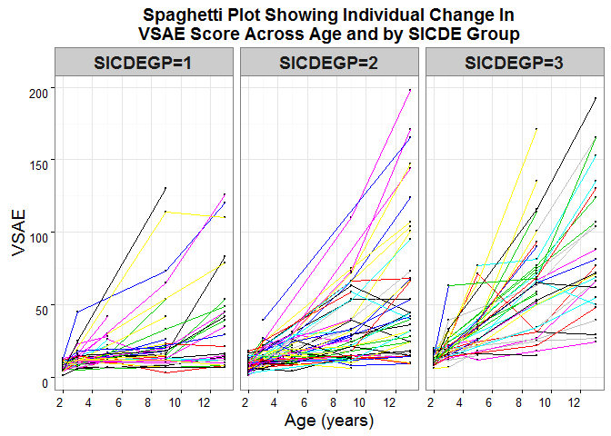

Various methods used to visualize longitudinal data
================
Lauren Johns
August 7, 2016

#### Data used for these examples were obtained from *Linear Mixed Models: A Practical Guide Using Statistical Software, Second Edition* by Brady T. West , Kathleen B . Welch , and Andrzej T . Gałecki. Data were downloaded and some code was adapted from [Chapter 6: Random Coefficient Models for Longitudinal Data](http://www-personal.umich.edu/~bwest/chapter6.html)

### **STEP 1:** Load and reclassify variables

-   This dataset is already in long form (multiple rows per individual) so no need to transform to wide form
-   The time-varying variables include:
    -   VSAE=dependent variable (social development score)
    -   AGE=independent variable

``` r
autism<- read.csv("C:/Users/laujohns/Documents/figures-for-longitudinal-data/autism.csv")
attach(autism)

#reformat some variables
autism$age2<-as.factor(autism$age)
autism$sicdegp2<-factor(autism$sicdegp, levels=c(1, 2, 3), labels=c("SICDEGP=1", "SICDEGP=2", "SICDEGP=3"))
attach(autism)

#check to make sure formatting correct
class(autism$age2)
class(autism$sicdegp2)

#run quick summary stats for mean vsae at each age and by each baseline expressive score (SICDE group)
tapply(vsae, age, mean, na.rm=T)
tapply(vsae, sicdegp, mean, na.rm=T)
```

### **STEP 2:** Load the necessary packages and create SICDEGP datasets

-   These datasets will be used later for GAMM modeling

``` r
#load necessary packages
library(mgcv)
library(nlme)
library(stats)
library(ggplot2)

#create datasets
autism.sicdegp1<-subset(autism,sicdegp==1)
autism.sicdegp2<-subset(autism,sicdegp==2)
autism.sicdegp4<-subset(autism,sicdegp==3)
```

### **STEP 4:** Create a spaghetti plot to visualize individual change in VSAE over age, by SICDEGP

``` r
library(ggplot2)

#Create complete dataset for spaghetti
autism.complete<-na.omit(autism[,c("vsae", "age", "childid",  "sicdegp2")])
attach(autism.complete)

##ggplot for spaghetti plot
plot.1<-ggplot(data=autism.complete, aes(age, vsae, colours=as.factor(childid)))+ 
                 geom_point(size=0.2)+geom_line(colour=childid, size=0.2)+facet_grid( ~ sicdegp2, labeller= label_value)+
  scale_x_continuous(name="Age (years)", breaks=c(2, 4, 6, 8, 10, 12)) + 
  scale_y_continuous(name="VSAE") +
  theme_bw()+
    ggtitle("Spaghetti Plot Showing Individual Change In\nVSAE Score Across Age and by SICDE Group")+
    theme(plot.title=element_text(face="bold",size=14, family="sans"), 
          axis.text.x = element_text(angle = 0, hjust = 1,vjust=1, size=10,family="sans"), 
          axis.text.y=element_text(vjust=1, size=10,family="sans"),
          text=element_text(size=14,family="sans"), 
          strip.text.x=element_text(size=14, face="bold",family="sans"),
          legend.title=element_blank())
plot.1
```


